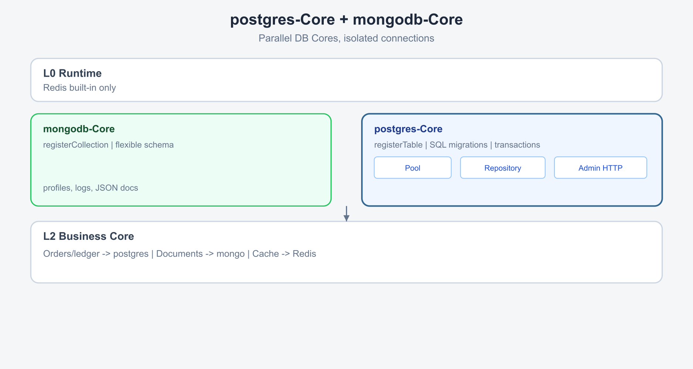
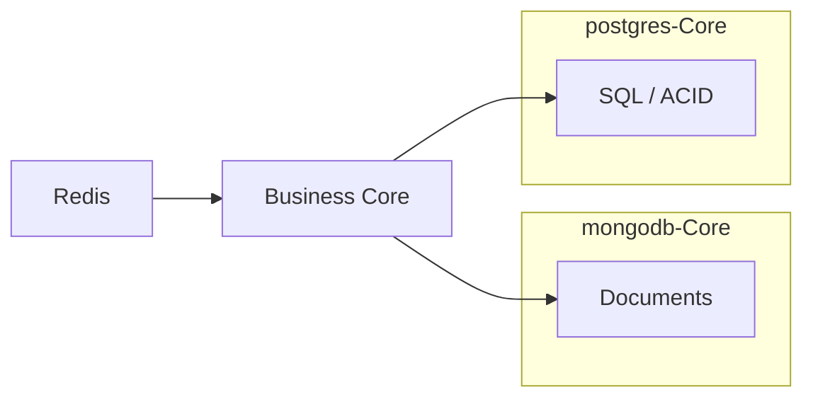

<div align="center">

<br>

# 🐘 postgres-Core

**PostgreSQL 持久化层 · 表注册 · Repository · SQL 迁移 · 事务 · 管理 API**

<sub>XRK-AGT 业务 Core · 安装于宿主 `core/postgres-Core`</sub>

<br>

[](https://github.com/sunflowermm/XRK-AGT)
[](https://www.postgresql.org/)

<br>

[安装](#安装) · [架构](#架构) · [API](#api-文档) · [快速开始](#快速开始) · [配置](#配置) · [HTTP](#http-api) · [迁移](#迁移) · [约定](#开发约定)

<br>

</div>

---

## 概述

postgres-Core 为 XRK-AGT 提供 PostgreSQL 连接池、表命名空间、Repository 基类、SQL 迁移与事务辅助，适用于订单、账务、报表等需要 ACID 与关系查询的场景。

| 项 | 说明 |
|---|---|
| 运行环境 | [XRK-AGT](https://github.com/sunflowermm/XRK-AGT)（Node ≥ 26） |
| 安装路径 | `core/postgres-Core/` |
| 依赖 | 宿主安装 `pg`；PostgreSQL 服务需自行部署 |
| 与 mongodb-Core | 可并行安装，分别负责关系型与文档型数据 |

---

## 安装

```bash
cd XRK-AGT/core
git clone https://github.com/sunflowermm/postgres-Core.git postgres-Core
cd ..
pnpm add pg
node app
```

首次启动时，配置从 `core/postgres-Core/default/postgres-core.yaml` 复制到 `data/postgres-core/config.yaml`。

---

## 架构





---

## API 文档

详见 **[`docs/API.md`](./docs/API.md)**。

| API | 说明 |
|---|---|
| `registerTable(owner, entity, options?)` | 注册表元数据与索引 SQL |
| `Repository` | 参数化 CRUD |
| `withTransaction(fn)` | 跨表事务 |
| `runMigrations()` | SQL  schema 迁移 |

---

## 快速开始

### 1. 迁移中定义表结构

```javascript
// migrations/shop/002_shop_orders.js
export default {
  id: '002_shop_orders',
  async up(pool) {
    await pool.query(`
      CREATE TABLE IF NOT EXISTS shop_orders (
        id BIGSERIAL PRIMARY KEY,
        order_id TEXT NOT NULL UNIQUE,
        user_id TEXT NOT NULL,
        amount NUMERIC(12,2) NOT NULL DEFAULT 0,
        status TEXT NOT NULL DEFAULT 'pending',
        created_at TIMESTAMPTZ NOT NULL DEFAULT NOW()
      )
    `);
  },
};
```

### 2. Repository

```javascript
import { registerTable, Repository, withTransaction } from '../../../postgres-Core/lib/index.js';

const ORDERS = registerTable('shop', 'orders', {
  indexSql: ['CREATE INDEX IF NOT EXISTS shop_orders_user ON shop_orders (user_id)'],
});

export class OrderRepo extends Repository {
  constructor() {
    super(ORDERS);
  }

  findByOrderId(orderId) {
    return this.findOne({ order_id: orderId });
  }
}
```

---

## 配置

| 项 | 路径 |
|---|---|
| 默认模板 | `core/postgres-Core/default/postgres-core.yaml` |
| 运行时 | `data/postgres-core/config.yaml` |
| 控制台 | CommonConfig → Postgres-Core |

---

## HTTP API

| 方法 | 路径 | 响应 |
|---|---|---|
| `GET` | `/api/postgres-core/health` | 连接与迁移状态 |
| `GET` | `/api/postgres-core/tables` | 已注册表 |
| `GET` | `/api/postgres-core/admin/stats` | 行数与索引数 |

---

## 迁移

- 路径：`migrations/**/*.js`
- 格式：`export default { id, async up(pool) { ... } }`
- 记录表：`_postgres_core_migrations`

---

## 与 mongodb-Core 分工

| 数据类型 | 推荐 Core |
|---|---|
| 订单、账务、库存、对账 | postgres-Core |
| 聊天记录、画像、JSON 文档 | mongodb-Core |
| 缓存、锁 | Runtime Redis |

---

## 开发约定

1. 通过 `postgres-Core/lib` 访问数据库，业务层不创建独立连接池。
2. 表结构写在 `migrations/`；`registerTable` 负责命名与索引声明。
3. 物理表名 `<core>_<entity>`，与 mongodb-Core 集合命名一致。
4. 用户输入仅通过 SQL 参数（`$1, $2…`）传递。

---

## 链接

- [API 参考](./docs/API.md)
- [mongodb-Core](https://github.com/sunflowermm/mongodb-Core)
- [XRK-AGT · Redis](https://github.com/sunflowermm/XRK-AGT/blob/main/docs/database.md)
- [AGENTS.md](./AGENTS.md)
