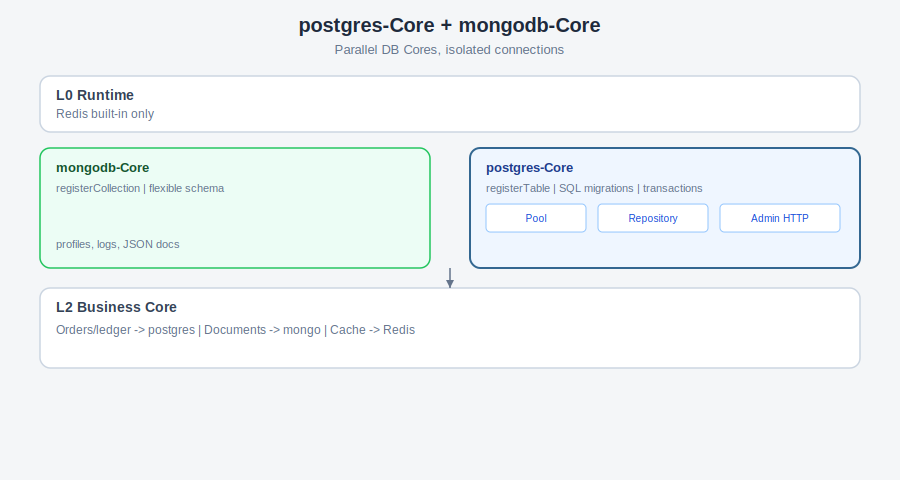

<div align="center">

<br>

# 🐘 postgres-Core

**PostgreSQL 专业管理层 · 表注册 · Repository · SQL 迁移 · 事务 · Admin API**

<sub>XRK-AGT 独立业务 Core · 单独 Git 仓库 · clone 到宿主 `core/postgres-Core` 运行</sub>

<br>

[](https://github.com/sunflowermm/XRK-AGT)
[](https://www.postgresql.org/)


<br>

[安装](#安装) · [架构](#架构) · [快速接入](#快速接入) · [配置](#配置) · [API](#http-api) · [迁移](#迁移) · [与 Mongo 分工](#与-mongodb-core-分工) · [铁律](#铁律)

<br>

</div>

---

## 项目定位

| 项 | 说明 |
|---|---|
| **仓库关系** | **独立仓库**，不入 XRK-AGT 主仓；AGT Runtime **不**依赖 PostgreSQL |
| **安装位置** | 宿主 `core/postgres-Core/`（与 `mongodb-Core` 同级，**互不干扰**） |
| **职责** | 连接池、表命名空间、Repository、SQL 迁移、索引治理、事务辅助、健康检查 HTTP |
| **典型场景** | 订单、账务、强事务、复杂 JOIN、合规报表 |
| **不做** | 业务订单逻辑本身（交给 L2 业务 Core） |

> **Redis** 仍由 AGT Runtime 内置。**MongoDB** 用 [`mongodb-Core`](../mongodb-Core/README.md) 管文档库；两者可同时启用。

---

## 安装

```bash
cd XRK-AGT/core
git clone <你的 postgres-Core 仓库 URL> postgres-Core
cd .. && pnpm add pg && node app
```

首次启动从 `default/postgres-core.yaml` 引导生成 **`data/postgres-core/config.yaml`**。

> 本 Core **无** `package.json`，使用宿主 `#` 别名。`pg` 驱动由宿主根目录 `pnpm add pg` 安装。

---

## 架构



```text
XRK-AGT Runtime       →  Redis（内置）
postgres-Core（本仓库）  →  Pool · registerTable · Repository · SQL migrations
mongodb-Core（可选）   →  文档库，并行不冲突
业务 Core              →  lib/store/*Repo.js，按场景 import 对应 lib
```

### 目录结构

```text
postgres-Core/
├── README.md · AGENTS.md
├── img/architecture.svg
├── commonconfig/postgres-core.js
├── default/postgres-core.yaml
├── plugin/init.js              # bootstrap + 挂全局 PostgresService
├── http/admin.js
├── lib/
│   ├── index.js                # ★ 公开 API
│   ├── client.js               # Pool / connect / ping
│   ├── table-registry.js
│   ├── repository-base.js
│   ├── migration-runner.js
│   ├── index-manager.js
│   ├── transaction.js · tenant.js · config.js
└── migrations/**/*.js          # SQL 迁移（CREATE TABLE 等）
```

---

## 快速接入

### 1. 迁移里建表

`migrations/lsy/002_lsy_orders.js`：

```javascript
export default {
  id: '002_lsy_orders',
  async up(pool) {
    await pool.query(`
      CREATE TABLE IF NOT EXISTS lsy_orders (
        id BIGSERIAL PRIMARY KEY,
        order_id TEXT NOT NULL UNIQUE,
        user_id TEXT NOT NULL,
        amount NUMERIC(12,2) NOT NULL DEFAULT 0,
        status TEXT NOT NULL DEFAULT 'pending',
        created_at TIMESTAMPTZ NOT NULL DEFAULT NOW()
      )
    `);
  },
};
```

### 2. 注册表 + Repository

```javascript
import { registerTable, Repository, withTransaction } from '../../../postgres-Core/lib/index.js';

const ORDERS = registerTable('lsy', 'orders', {
  indexSql: ['CREATE INDEX IF NOT EXISTS lsy_orders_user ON lsy_orders (user_id)'],
});

export class OrderRepo extends Repository {
  constructor() {
    super(ORDERS);
  }

  findByOrderId(orderId) {
    return this.findOne({ order_id: orderId });
  }

  createOrder(row) {
    return this.insert(row);
  }
}

// 强事务示例
export async function transferOrder(orderId, patch) {
  return withTransaction(async (client) => {
    await client.query('UPDATE lsy_orders SET status = $1 WHERE order_id = $2', ['paid', orderId]);
    // … 其它表
  });
}
```

### 3. 插件内全局

```javascript
const pool = PostgresService.getPool();
const { rows } = await pool.query('SELECT 1');
```

---

## 配置

| 项 | 路径 |
|---|---|
| 默认模板 | `core/postgres-Core/default/postgres-core.yaml` |
| 运行时 | `data/postgres-core/config.yaml` |
| 控制台 | CommonConfig → **Postgres-Core** |

| 字段 | 说明 |
|---|---|
| `connection.host` / `port` / `database` | PostgreSQL 连接 |
| `connection.username` / `password` | 认证 |
| `connection.poolSize` | 连接池大小（默认 10） |
| `runMigrationsOnBoot` | 启动跑迁移（默认 `true`） |
| `ensureIndexesOnBoot` | 按 `registerTable.indexSql` 建索引 |

---

## HTTP API

| 方法 | 路径 | 说明 |
|---|---|---|
| `GET` | `/api/postgres-core/health` | 连接与迁移状态 |
| `GET` | `/api/postgres-core/tables` | 已注册表列表 |
| `GET` | `/api/postgres-core/admin/stats` | 各表行数与索引数 |

---

## 迁移

- 目录：`migrations/**/*.js`
- 记录表：`_postgres_core_migrations`
- 每个文件导出 `{ id, up(pool) }`，`up` 内写 SQL

```javascript
export default {
  id: '003_lsy_users',
  async up(pool) {
    await pool.query(`CREATE UNIQUE INDEX IF NOT EXISTS lsy_users_email ON lsy_users (email)`);
  },
};
```

---

## 与 mongodb-Core 分工

| 场景 | 推荐 |
|---|---|
| 订单、支付、库存扣减、对账 | **postgres-Core** |
| 用户画像、聊天记录、配置快照、快速迭代 JSON | **mongodb-Core** |
| 缓存、锁、会话 | **Redis（Runtime）** |
| 同一业务 Core 两种都要 | 各写各的 `*Repo.js`，分别 import |

---

## 铁律

1. **禁止**业务 Core 直接 `new Pool()` 或裸连 — 走 `postgres-Core/lib`
2. 表必须 `registerTable('<core>', '<entity>')`，DDL 在 `migrations/`
3. 表名格式 **`<core>_<entity>`**，与 Mongo 集合同规则，便于团队统一
4. 复杂查询可在 Repository 子类写参数化 SQL，禁止拼接用户输入
5. 本 Core 升级不影响 AGT 主仓

---

## 相关文档

- [`mongodb-Core`](../mongodb-Core/README.md) — 文档库 Core
- AGT Redis：[`docs/database.md`](https://github.com/sunflowermm/XRK-AGT/blob/main/docs/database.md)
- 产品 Agent：[`AGENTS.md`](./AGENTS.md)

---

*最后更新：2026-07-13*
